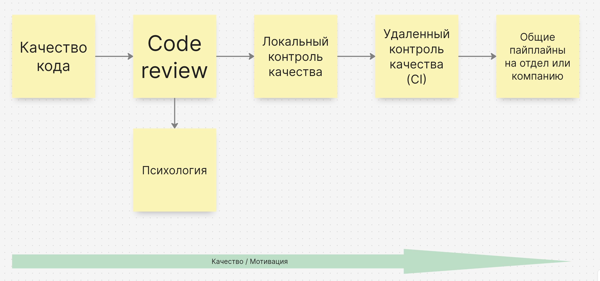

# Тезисы к докладу

1. **Качество кода**. Хороший код добавляет мотивации, плохой убивает ее. Часто под "плохим" кодом мы имеем в виду не понятный - рассказать историю Сквера, когда каждый новый разраб ругается на предыдущего и переписывает предыдущий код. Кажется что мы можем судить о качестве кода по нескольким критериям:
	- Ясное именование переменных (`MAX_DELAY_SEC` вместо `TIME`) и функций (`calculate_time` вместо `calct`).
	- Просто это сложно. Простой код VS сложный код, в чем разница и почему первый подход лучше. 
	- Разбиение на логические блоки и модули - например SOLID, а не огромные методы и классы, которые делают все.
	- Сильная связность, слабое зацепление.
	- Умное применение лучших практик - инъекция зависимостей.
	- Архитектура кода.
	- Оптимизированные алгоритмы в том числе и в работе с БД.
	- Документация (в том числе само-документация) и комментарии (могут быть опасными).
	
2. **Code Review**. Бывают разные подходы к проведению - от просто глянуть код на синтаксис, до более глубокого погружения и запуска локально и полноценной проверки фичи. Хорошо выбрать и прописать лучшие и худшие практики и зафиксировать их в документации.
   - *Как проводить ревью*:
	- МР не должен быть идеальным, но он должен улучшать кодовую базу.
	- Отдавайте предпочтения лучшим практикам и не допускайте просачивание худших.
	- NT-комментарии (от nitpick) - мелочи и придирки. Такого рода комментарии можно оставлять на усмотрение автора.
	- Практика резолва тредов в МР-е - например тот, кто создает комментарий обязан зарезолвить все свои треды. Без резолва тредов нельзя вливать.
	- Важна скорость - если МР висит неделю это очень плохой пример. Хорошо посмотреть один раз МР полностью, чем давать раз в час по комментарию - переключение контекста дорогая операция.
	- Не делайте слишком большие МР - почти всегда  возможно разбить один гигантский МР на несколько поменьше. Хорошо внедрить как практику - возможность попросить совета старшего.
	- Часто лучше объяснять замечания примером кода.
   - *Психология*:
	- Психология крайне важная часть и важно сходу обсудить, что критикуют не вас, а предполагаемые решения. Крайне важно быть вежливым и бережным к вашим коллегам, особенно если вы в достаточно новой команде. 
	- Не только критикуйте, но и хвалите удачные решения. Про это часто забывают.
	- Не допускать срача, лучше сворачивайте такие разговоры, срач будет нести долгосрочные последствия. Если не можете договориться, привлекайте третьего, зовите лида. Обсуждайте волнующие вас вопросы на спринт ревью.
	- Важно чтобы была культура - мы здесь решаем задачу бизнеса, а не ругаемся друг с другом - это позволит вам рости внутри компании, другие помогают найти проблемы, а не унизить, ревьювер не враг, а тот, кто помогает как сделать лучше.
	- Попробуйте поставить себя на место того, кого вы сейчас ревьювите - насколько уважительно с вами общаются в комментариях к вашему коду?
	- Общайтесь уважительно, задавайте вопросы, предлагайте лучшие решения, сомневайтесь.

3. **Локальный контроль качества**.
   Для локальной проверки можно использовать `pre-commit`.
	- *Статическая проверка*:
		- Запрет на вливание в `main` без аппрува от другого человека.
		- Линтеры -`pylint`, `flake8`, `ruff`.
		- Форматтеры `black`, `isort`.
		- Типизация - `mypy`.
		- Анализ - `sonarqube`.
	- *Динамическая проверка*:
		- Тесты - юнит, интеграционные, e2e - `unittest`, `pytest`, `hypothesis`.
		- Проверка покрытия тестами - `coverage`, не уменьшение покрытия с предыдущего запуска (хранение артефактов), либо же задание определенного процента покрытия и не уменьшение этого процента.
		- TODO: написать как это сделать про не уменьшение покрытия.

4. **Удаленный контроль качества (CI)**. Для удаленного контроля качества можно использовать `github actions` или `gitlab pipelines`. Локальной проверки не достаточно - если падают линтеры, форматеры, тесты то должен быть запрет на вливание кода в `main`. Крайне важная история со скоростью работы ваших проверок - если будет слишком долго этим будет не удобно пользоваться. Хорошо чтобы базовый образ весил не много, хранился в вашем локальном хранилище образов и работал шустро - упростите себе жизнь.  

5. **Общие пайплайны на отдел или компанию**. Отдельный репозиторий в котором настроены джобы для линтеров, форматеров, тестов и т.д. Уделите время хорошей документации по тому как работают ваши общие пайплайны и по тому как их подключать. это значительно уменьшит порог входа и вашими пайплайнами будут пользоваться. Привести пример. Нарисовать степень крутости компании по шагам:
	1. Следим за качеством кода.
	2. Проводим code review.
	3. Код проверяется автоматически.
	4. Настроены удаленные пайплайны.
	5. Есть общие пайплайны для всей компании, которые легко подключаются и хорошо документированы.

- #TODO: рассказать истории как я внедрял подобную историю, какие были боли и как я победил

Все эти практики повышают мотивацию людей работать у вас и для части инженеров будет крайне интересно поучаствовать в формировании инженерной культуры в вашей компании начиная с уровня middle. Не бойтесь дорабатывать эти правила под вас и документируйте их - единый источник правды в тексте решает.